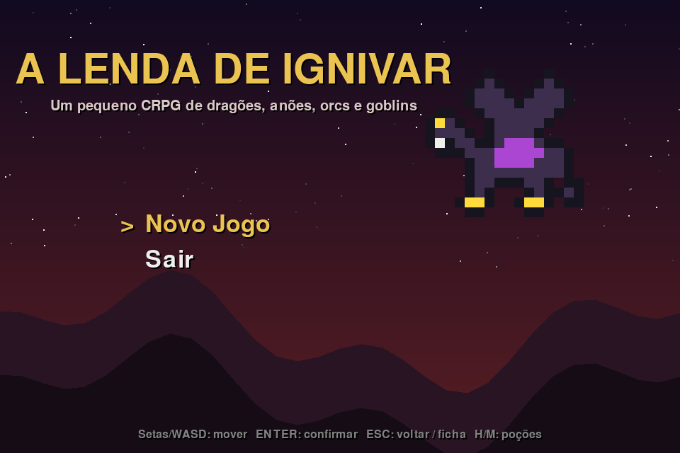
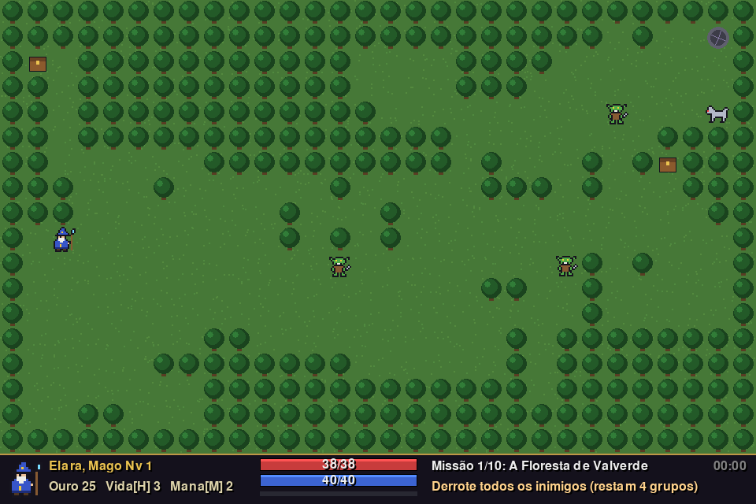
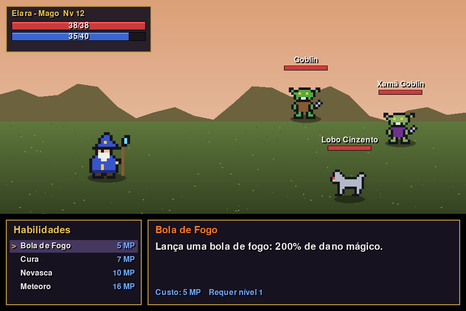
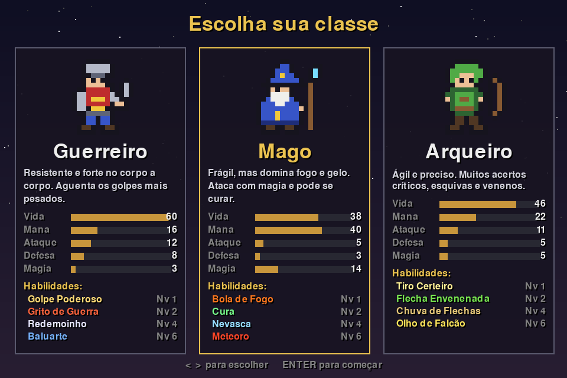
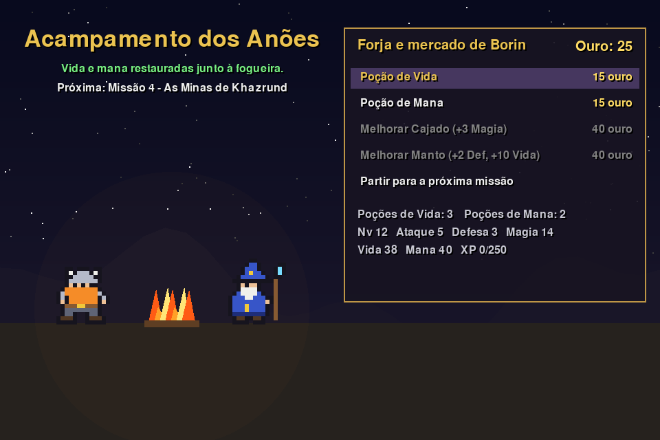

# ⚔️ A Lenda de Ignivar

🇧🇷 Português | [🇺🇸 English](README.en.md)


Um pequeno **CRPG medieval** em pixel art, feito em Python com pygame. Explore florestas, minas e fortalezas, enfrente goblins, orcs e esqueletos, resgate anões e derrote **Ignivar, o Dragão Negro**, em uma aventura de 10 missões que dura menos de uma hora.

Todos os gráficos são gerados pelo próprio código: não há nenhum arquivo de imagem ou som externo. O jogo inteiro cabe em um único arquivo `.py`.



---

## 📜 História

Ignivar, o Dragão Negro, despertou e reuniu goblins e orcs sob suas asas. Pedraforte, o último reino dos anões, está ameaçado. Guiado por **Borin Martelo-de-Pedra**, guardião dos anões, você atravessa florestas, colinas, minas, pântanos e picos gelados até chegar ao covil do dragão.

## ✨ Características

- **3 classes jogáveis:** Guerreiro, Mago e Arqueiro, cada uma com 4 habilidades próprias.
- **10 missões** com objetivos variados: derrotar todos os inimigos, resgatar anões ou vencer um chefe.
- **Combate por turnos** com magias, venenos, bônus temporários, acertos críticos, esquivas e animações.
- **Mapas gerados proceduralmente** em 10 cenários diferentes, sempre com caminho garantido até a saída.
- **Progressão de personagem:** níveis, novas habilidades e melhorias de arma e armadura.
- **Acampamento dos anões** entre as missões, com loja e descanso.
- **4 chefes**, incluindo um dragão que solta Sopro de Fogo Negro.
- **Pixel art 100% gerada por código**, sem arquivos externos.

## 🖼️ Capturas de tela

| Exploração | Combate |
|:---:|:---:|
|  |  |

| Seleção de classe | Acampamento |
|:---:|:---:|
|  |  |

## 🚀 Como jogar

### Requisitos

- Python 3.8 ou superior
- pygame 2

### Instalação

```bash
git clone https://github.com/bcastroalves/lenda-de-ignivar.git
cd lenda-de-ignivar
pip install -r requirements.txt
python lenda_de_ignivar.py
```

> 💡 No Linux ou macOS, talvez seja necessário usar `python3` e `pip3`.

## 🎮 Controles

| Tecla | Ação |
|---|---|
| Setas / WASD | Mover no mapa e navegar nos menus |
| Enter / Espaço | Confirmar |
| Esc | Voltar / abrir a ficha do personagem (no mapa) |
| H | Beber Poção de Vida (no mapa) |
| M | Beber Poção de Mana (no mapa) |

No mapa, basta andar até um inimigo para iniciar o combate. Inimigos próximos também perseguem você.

## 🛡️ Classes

| Classe | Estilo | Habilidades (nível) |
|---|---|---|
| **Guerreiro** | Muita vida e defesa, forte no corpo a corpo | Golpe Poderoso (1), Grito de Guerra (2), Redemoinho (4), Baluarte (6) |
| **Mago** | Frágil, mas com magias poderosas e cura | Bola de Fogo (1), Cura (2), Nevasca (4), Meteoro (6) |
| **Arqueiro** | Ágil, com muitos críticos, esquivas e venenos | Tiro Certeiro (1), Flecha Envenenada (2), Chuva de Flechas (4), Olho de Falcão (6) |

## 🗺️ Missões

| # | Missão | Cenário | Objetivo |
|:---:|---|---|---|
| 1 | A Floresta de Valverde | Floresta | Derrotar todos os inimigos |
| 2 | A Estrada dos Mercadores | Estrada | Resgatar 3 anões |
| 3 | As Colinas Uivantes | Colinas | Derrotar Gnarl, o Rei Goblin |
| 4 | As Minas de Khazrund | Caverna | Resgatar 4 anões |
| 5 | Os Salões Profundos | Caverna de cristal | Derrotar o Troll das Cavernas |
| 6 | O Pântano dos Mortos | Pântano | Derrotar todos os inimigos |
| 7 | A Fortaleza de Grukk | Fortaleza | Derrotar Grukk, Senhor da Guerra |
| 8 | Os Picos Gélidos | Montanhas nevadas | Resgatar 3 anões |
| 9 | O Ninho dos Dragões | Ninho vulcânico | Derrotar todos os inimigos |
| 10 | O Covil de Ignivar | Covil do dragão | Derrotar Ignivar, o Dragão Negro |

## 👹 Inimigos

| Inimigo | Comportamento |
|---|---|
| Goblin | Inimigo básico e numeroso |
| Xamã Goblin | Lança Dardos de Fogo e cura os aliados |
| Lobo Cinzento | Mordida venenosa |
| Orc | Forte e resistente, usa Esmagar |
| Orc Berserker | Entra em fúria e aumenta o próprio ataque |
| Esqueleto | Defesa alta |
| Dragão Jovem | Ataques físicos e Dardos de Fogo |

**Chefes:** Gnarl, o Rei Goblin • Troll das Cavernas (regenera vida a cada turno) • Grukk, Senhor da Guerra • Ignivar, o Dragão Negro (Sopro de Fogo Negro a cada 3 turnos)

## ⚙️ Mecânicas

- **Combate:** a cada turno você escolhe entre Atacar, Habilidades, Itens ou Fugir. Não é possível fugir de chefes.
- **Dano físico** usa Ataque e é bastante reduzido pela Defesa do alvo. **Dano mágico** usa Magia e ignora boa parte da Defesa.
- **Venenos** causam dano por 3 turnos. **Bônus** como Grito de Guerra também duram 3 turnos.
- **Após cada vitória** você recupera parte da vida e da mana. A mana também se regenera um pouco a cada turno.
- **Baús** escondidos nos mapas contêm ouro e poções.
- **Derrota:** você pode recomeçar a missão atual com o personagem no estado em que ela começou.

## 💡 Dicas

- Guarde poções para as lutas contra chefes.
- Contra grupos, use habilidades que atingem todos os inimigos (Redemoinho, Nevasca, Chuva de Flechas).
- Derrote primeiro os Xamãs Goblins, porque eles curam os aliados.
- Antes do dragão, tenha a vida alta no turno em que ele vai soltar o Sopro de Fogo Negro.

## 🛠️ Personalização

Todos os dados do jogo ficam em dicionários no início do arquivo, então é fácil ajustar a dificuldade ou criar conteúdo novo:

| Dicionário | O que controla |
|---|---|
| `CLASSES` | Atributos iniciais, crescimento por nível e habilidades de cada classe |
| `SKILLS` | Custo, dano, efeitos e nível necessário das habilidades |
| `INIMIGOS` | Vida, ataque, defesa, recompensas e comportamento dos inimigos |
| `MISSOES` | Nome, cenário, objetivo, inimigos e texto de cada missão |
| `THEMES` | Cores e tipo de terreno de cada cenário |
| `SPRITES` | Pixel art dos personagens em grades de 16×16 caracteres |

Os sprites são desenhados como texto: cada letra representa uma cor da paleta `PAL` e o ponto (`.`) é transparente. Para criar um personagem novo, basta desenhar uma nova grade.

## 📁 Estrutura do projeto

```
lenda-de-ignivar/
├── lenda_de_ignivar.py   # o jogo completo
├── requirements.txt      # dependências (pygame)
├── README.md             # este arquivo (português)
├── README.en.md          # versão em inglês
└── imagens/              # capturas de tela usadas no README
```

## 📄 Licença

Distribuído sob a licença MIT. Veja o arquivo [LICENSE](LICENSE) para mais detalhes.

## 👤 Autor

**Bruno** · [@bcastroalves](https://github.com/bcastroalves)

---

*Por Pedraforte!* ⚒️🐉
